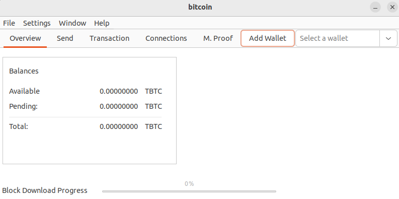
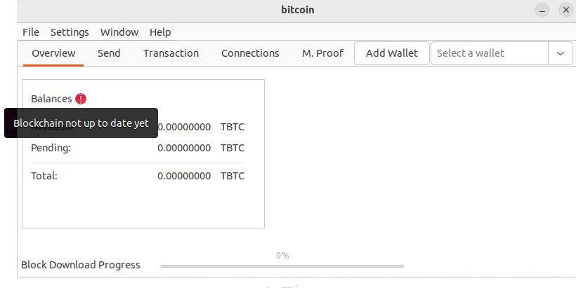
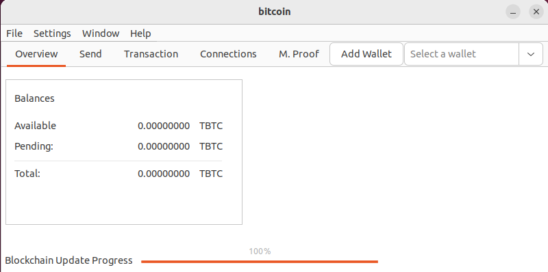
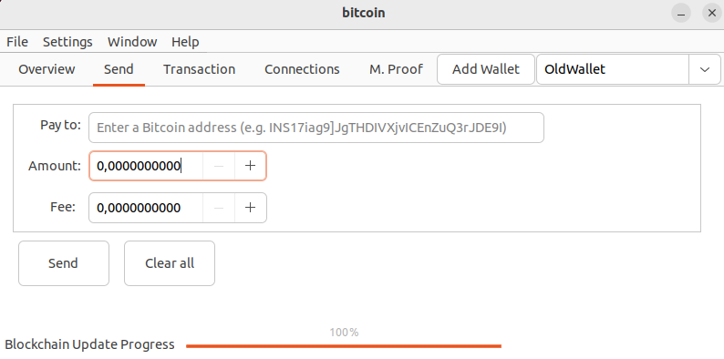

# Bitcoing Node Wallet - CargoSOS

The **CargoSOS Bitcoin Node Wallet** is a Rust-written node wallet for the bitcoin testnet peer to peer network. It includes a TUI (terminal user interface) and a GUI (graphical user interface) implemented using the GTK-3 library.

It was developed following [the bitcoin developer guides](https://developer.bitcoin.org/devguide/index.html) and [the bitcoin reference guides](https://developer.bitcoin.org/reference/index.html).

## Capabilities

Our programs capabilities are as follows:

- Node
    - Connecting to other peers in the bitcoin network through a TCP connection following the [protocol](https://developer.bitcoin.org/devguide/p2p_network.html#connecting-to-peers). To achieve this we make use of multiple **threads** to manage each connection.
    - Being able to receive and send [the different messages described in the protocol](https://developer.bitcoin.org/reference/p2p_networking.html).
    - Downloading and storing the complete blockchain, storing all the [block headers](https://developer.bitcoin.org/reference/block_chain.html#block-headers) that have ever existed, and all the [transactions](https://developer.bitcoin.org/reference/block_chain.html#serialized-blocks) starting from a date expressed in Unix Epoch Time in the configuration file.
    - Being able to serialize the blockchaing into a file for persistency and reading it upon the programs start.
    - Upon the programs start, updating the blockchain with the new blocks using a [headers-first approach](https://developer.bitcoin.org/devguide/p2p_network.html#headers-first).
    - When the program is active, it updates the internal data as it receives messages from other peers, including new [blocks](https://developer.bitcoin.org/reference/block_chain.html#serialized-blocks) and [transactions](https://developer.bitcoin.org/reference/transactions.html).
    - When receiving Block information from other peers, executes a [Proof of Work](https://developer.bitcoin.org/devguide/block_chain.html#proof-of-work) to validate it, and a Proof of Inclusion when receiving its transactions, by creating a [Merkle Tree](https://developer.bitcoin.org/reference/block_chain.html#merkle-trees).
    - Keeps a record of all the [UTXO](https://developer.bitcoin.org/devguide/transactions.html) (unspent transactions) for easier calculation of balance.
    - The node can be run as a **Server**, listening to a port we can specify in the configuration file for incoming connections, while at the same time connecting with other peers.
    - The node can be run as a client, trying to connect to a single specific port and IP address to make it its peer.
- Wallet
    - Our program can store [bitcoin addresses](https://www.bitaddress.org/bitaddress.org-v3.3.0-SHA256-dec17c07685e1870960903d8f58090475b25af946fe95a734f88408cef4aa194.html?testnet=true) that the user provides by specifying the [public and private keys](https://en.bitcoin.it/wiki/Private_key). 
        - Addresses can be created [here](https://www.bitaddress.org/bitaddress.org-v3.3.0-SHA256-dec17c07685e1870960903d8f58090475b25af946fe95a734f88408cef4aa194.html?testnet=true).
        - Test coins can be added [here](https://coinfaucet.eu/en/btc-testnet/).
    - Our program can calculate the current balance of a given address by adding up the [UTXO](https://developer.bitcoin.org/devguide/transactions.html) corresponding to it.
    - Every time we receive an unconfirmed transaction from a peer that involves one of the addreses currently stored in the wallet, it is notified. 
    - Every time we receive a new block sotring a transaction that involves one of the addreses currently stored in the wallet, it is notified.
    - **The user can generate [transactions](https://developer.bitcoin.org/devguide/transactions.html) by providing the necessary information about the recipient.** The supported protocol is [P2PKH](https://developer.bitcoin.org/devguide/transactions.html#p2pkh-script-validation).
    - Given a transaction and a block, a user can do a [Merkle Proof of Inlcusion](https://developer.bitcoin.org/reference/block_chain.html#merkle-trees) to know if a transaction is part of a block.
    - The bitcoin addresses are stored in a file for persistency and read when the program starts again.
- Configuration
    - The program accepts a configuration file where we can specify various parameters and preferences about the program being run, like:
        - P2P protocol version.
        - Initial block download method (only supports Headers First)
        - The amount of peers we would like to connect to and where to look for them.
        - The port and address the node can run on as a server.
        - Wheter or not we would like the *logs* to be printed to the console
        - The paths to the places we would like to read or write persistency files.
        - The timestamp in Unix Epoch Time from which the full blocks on the blockchained are going to be downloaded.
        - The type of interface we would like to use (GUI or TUI).
- Logs
    - The program has a log system that will store information about the things happening during the execution.

## Program in action

### Graphical User Interface

The programs Graphical User Interface was developed with the GTK-3 library in rust. 

#### Initial State Of The appication





#### The blockchain is not up to date yet



#### The blockchain is up to date and the progress bar is full




#### Select one of the loaded wallets


#### A wallet is selected and its balance is shown


#### Sending a transaction




Last transactions received
./img_md/LastTransactionsReceived.png

Peers to which we are currently connected
./img_md/CurrentConnections.png

Merkle proof of inclusion
./img_md/MerkleProofOfInclusion.png

### Terminal User Interface

In addition to the GUI, we also implemented a TUI to be able to use the program with the command line. It has a menu and depending on what you choose, it will ask for specific information or display the information requested.

Terminal User Interface
./img_md/TUI.png


## Execution

To execute the proyect, the following command has to be used

``` bash
cargo run --bin bitcoin path/to/node.conf
```

### Execute as server

``` bash
cargo run --bin bitcoin src/bin/bitcoin/node_server.conf
```

### Execute as client

``` bash
cargo run --bin bitcoin src/bin/bitcoin/node_client.conf
```

## Presentations

Since this program was developed by us during a university course, we did three presentations showcasing the structure and evolution of our program.

### Intermediate Course Evaluation

The presentation can be found at:
[https://docs.google.com/presentation/](https://docs.google.com/presentation/d/1ZxR5ELNhXvUWMrplKweA960f2aaQDdz4rgTy2F7DByE/edit?usp=sharing)

### Final Course Evaluation

The presentation can be found at:
[https://docs.google.com/presentation/](https://docs.google.com/presentation/d/1ZTZakfa6C_cEqRleuVLvt15ozlHgYyQgsc0Y27uw75w/edit?usp=sharing)

### Final Presentation
The presentation can be found at:
[https://docs.google.com/presentation/](https://docs.google.com/presentation/d/1HmbcJOZDrY8uNopGFmVyevb3y6KvQpLTpPB8VDF4C6A/edit?usp=sharing)
